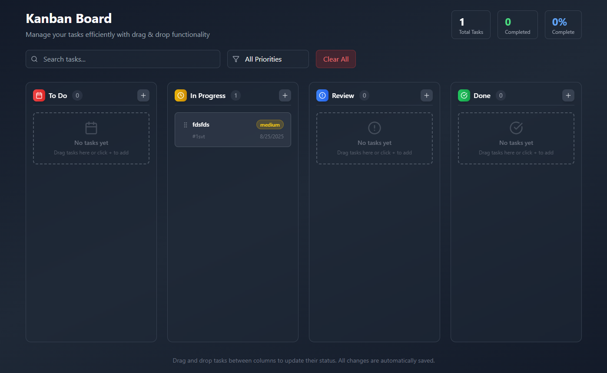

# 🗂️ React Kanban Board

A simple and modern **Kanban Board** built with **React (Vite)** and **Tailwind CSS**, featuring:

- 🖱️ **Drag & Drop** between columns and within columns
- 📌 **Dynamic Drop Zones** (place tasks anywhere between others)
- ✨ **Highlight Line Preview** where the task will land
- 💾 **LocalStorage Persistence** (tasks stay after refresh)
- ➕ **Modal to Add Tasks** with priority and due date
- 🎨 Clean, responsive UI with Tailwind styling

---

## 🚀 Features

- Create, edit, and organize tasks across columns (`To Do`, `In Progress`, `Review`, `Done`)
- Drag & drop tasks between columns or reorder inside the same column
- Hover effects and draggable indicators (using `lucide-react` icons)
- Smooth highlight line when dragging
- Persistent storage using **localStorage**

---

## 📂 Project Structure

```
├── index.html
├── package.json
├── postcss.config.js
├── tailwind.config.js
├── src
│   ├── App.jsx             # Main App entry
│   ├── main.jsx            # Vite entry point
│   ├── style.css           # Tailwind + global styles
│   ├── components
│   │   ├── AddTaskModal.jsx  # Modal for creating new tasks
│   │   ├── Column.jsx        # Column component (To Do, In Progress, etc.)
│   │   ├── KanbanBoard.jsx   # Main board layout
│   │   ├── TaskCard.jsx      # Individual draggable task card
│   └── ...
└── public
    └── vite.svg
```

---

## 🛠️ Installation & Setup

1. **Clone the repository** (or unzip the folder)

   ```bash
   git clone <your-repo-url>
   cd kanban-board
   ```

2. **Install dependencies**

   ```bash
   npm install
   ```

3. **Start the development server**

   ```bash
   npm run dev
   ```

4. Open in your browser → [http://localhost:5173](http://localhost:5173)

---

## 📦 Build for Production

```bash
npm run build
```

This generates an optimized build in the `dist/` folder.

---

## 🖼️ Screenshots

> Example layout with tasks:

  

---

## ⚡ Tech Stack

- [React](https://react.dev/)
- [Vite](https://vitejs.dev/)
- [Tailwind CSS](https://tailwindcss.com/)
- [Lucide Icons](https://lucide.dev/)

---